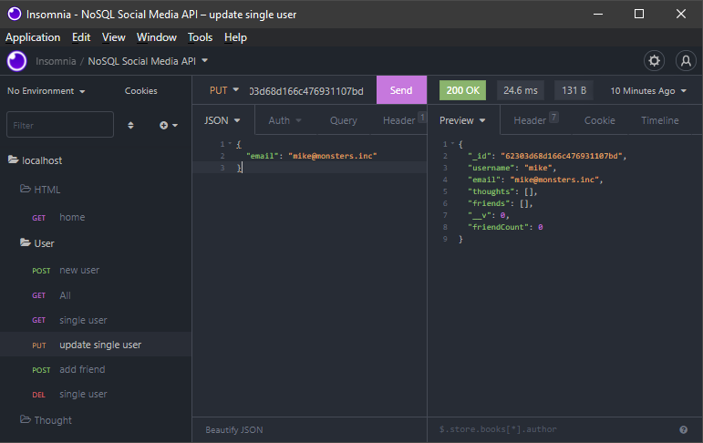

# Social Media API

A social media back-end api built with Node.js, Express.js, and MongoDB. The functionality includes CRUD operations for User, Thoughts, and Reactions. Users may add friends, write thoughts and react to friend's thoughts. See the video at the link in the preview below for a demonstration of the routes.

## Index

- [Installation](#installation)
- [Usage](#usage)
- [License](#license)
- [Built With](#built-with)
- [Questions](#questions)

## Installation
[^](#index)

Clone the repository

    git clone git@github.com:scottrohrig/nosql-social-media-api.git

Requires [Node.js](https://nodejs.dev/learn/how-to-install-nodejs) and [MongoDB](https://docs.mongodb.com/manual/installation/)

Install the necessary dependencies

    npm i

## Usage
[^](#index)

Start the server

    npm start

Import Insomnia routes using this file

    ./assets/Insomnia_2022-03-15.json

## License
[^](#index)

## Built With
[^](#index)

## Questions

Feel free to contact me using the information below!

- GitHub Profile: [@scottrohrig](https://github.com/scottrohrig)

- Email: scott.rohrig@gmail.com

- Project Repository/URL: [github.com/.../nosql-social-media-api](https://github.com/scottrohrig/nosql-social-media-api)
